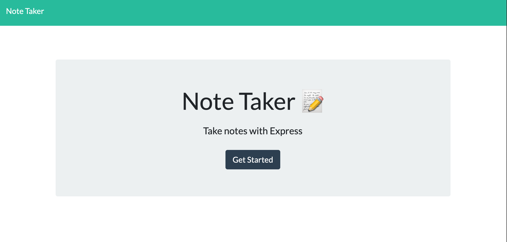
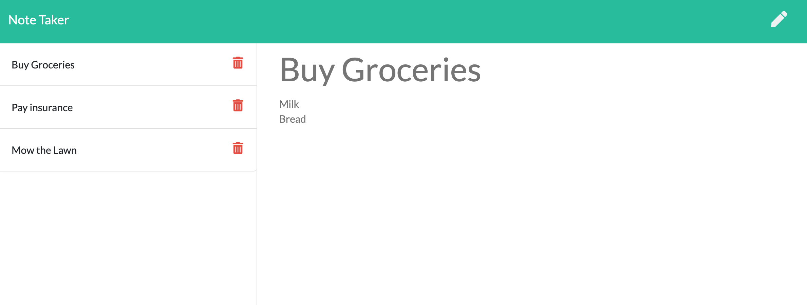

# Note Taker

## Table of Contents

- [Description](#desciption)
- [Installation](#installation)
- [Usage](#Usage)
- [Contribution](#Contribution)
- [Test](#test)
- [License](#license)

## Description

[Deployed Application](https://dashboard.heroku.com/apps/protected-caverns-31589)
 

This project is a full stack applcation with a front and back end. This is the perfect program for note taking. The user can make new notes and delete old notes.

 
The information which is typed into the note section is received through the client and then sent to the server. The server then delivers this information back which results in the list being generated for the user to see the information.

## License

 
None

## Installation

npm i

## Usage

1. Access application at Heroku.
2. Click on get started.
3. Enter new note.
4. Save note.
5. Add new notes or delete old notes as needed.

## Contribution

No contribution is needed.

## Test

The application is deployed on Heroku.

## For any additional questions please contact me at:

Email: israelguillermo22@gmail.com
 
GitHub: [IsraelGuillermo](https://github.com/IsraelGuillermo)
